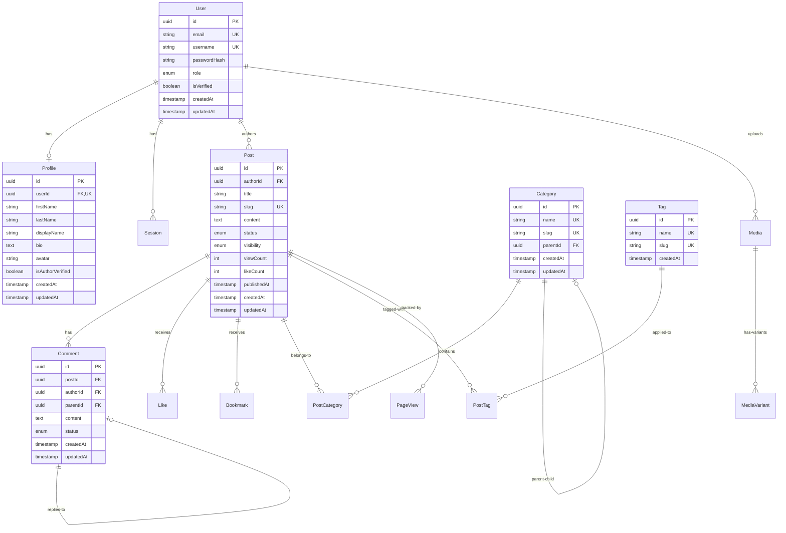

# Blog Platform Database Schema

## 1. Overview

This document provides a comprehensive guide to the database schema for the Blog Platform. The schema is designed following **normalization principles**, **referential integrity**, and **performance optimization** best practices.

### 1.1 Database Technology

- **DBMS**: PostgreSQL 15+
- **ORM**: Prisma
- **Schema Management**: Prisma Migrations
- **Logical Separation**: Schemas (`auth`, `content`, `analytics`, `media`)

### 1.2 Design Principles

- **Normalization**: 3NF (Third Normal Form) to minimize redundancy
- **Referential Integrity**: Foreign keys with cascade rules
- **Soft Deletes**: Where applicable (posts, comments)
- **Audit Trails**: `createdAt`, `updatedAt` timestamps
- **Performance**: Strategic indexes on frequently queried columns

---

## 2. Schema Overview Diagram



---

## 3. Domain Separation

The schema is logically separated into four domains:

| Domain        | Schema Name | Tables                                       | Purpose                      |
| ------------- | ----------- | -------------------------------------------- | ---------------------------- |
| **Auth**      | `auth`      | User, Profile, Session                       | Identity & Access Management |
| **Content**   | `content`   | Post, Comment, Category, Tag, Like, Bookmark | Core blogging functionality  |
| **Analytics** | `analytics` | PageView, AnalyticsEvent                     | Tracking & metrics           |
| **Media**     | `media`     | Media, MediaVariant                          | File storage & processing    |

---

## 4. Detailed Table Definitions

### 4.1 Auth Domain

#### **Table: `User`**

**Purpose**: Core user identity and authentication.

| Column         | Type      | Constraints           | Description                      |
| -------------- | --------- | --------------------- | -------------------------------- |
| `id`           | UUID      | PRIMARY KEY           | Unique user identifier           |
| `email`        | VARCHAR   | UNIQUE, NOT NULL      | User email (login)               |
| `username`     | VARCHAR   | UNIQUE, NOT NULL      | Unique username                  |
| `passwordHash` | VARCHAR   | NULLABLE              | Hashed password (null for OAuth) |
| `role`         | ENUM      | NOT NULL, DEFAULT     | User role (see UserRole enum)    |
| `isVerified`   | BOOLEAN   | NOT NULL, DEFAULT     | Email verification status        |
| `createdAt`    | TIMESTAMP | NOT NULL, DEFAULT NOW | Account creation time            |
| `updatedAt`    | TIMESTAMP | NOT NULL, AUTO UPDATE | Last update time                 |

**Enum: `UserRole`**

```typescript
enum UserRole {
  READER   // Can read and comment
  AUTHOR   // Can create posts
  EDITOR   // Can edit others' posts
  ADMIN    // Full system access
}
```

**Relationships**:

- **1:1** with `Profile` (cascade delete)
- **1:N** with `Session` (cascade delete)
- **1:N** with `Post` (as author)
- **1:N** with `Comment` (as author)
- **1:N** with `Like`
- **1:N** with `Bookmark`
- **1:N** with `Media` (as uploader)

**Indexes**:

```sql
CREATE INDEX idx_user_email ON users(email);
CREATE INDEX idx_user_username ON users(username);
CREATE INDEX idx_user_role ON users(role);
```

---

#### **Table: `Profile`**

**Purpose**: Extended user information and author details.

| Column             | Type      | Constraints           | Description               |
| ------------------ | --------- | --------------------- | ------------------------- |
| `id`               | UUID      | PRIMARY KEY           | Unique profile identifier |
| `userId`           | UUID      | FOREIGN KEY, UNIQUE   | References User.id        |
| `firstName`        | VARCHAR   | NULLABLE              | User's first name         |
| `lastName`         | VARCHAR   | NULLABLE              | User's last name          |
| `displayName`      | VARCHAR   | NULLABLE              | Public display name       |
| `bio`              | TEXT      | NULLABLE              | Author biography          |
| `avatar`           | VARCHAR   | NULLABLE              | Avatar image URL          |
| `website`          | VARCHAR   | NULLABLE              | Personal website          |
| `twitter`          | VARCHAR   | NULLABLE              | Twitter handle            |
| `linkedin`         | VARCHAR   | NULLABLE              | LinkedIn profile          |
| `github`           | VARCHAR   | NULLABLE              | GitHub username           |
| `isAuthorVerified` | BOOLEAN   | NOT NULL, DEFAULT     | Verified author badge     |
| `authorBadge`      | VARCHAR   | NULLABLE              | Badge type (Expert, etc.) |
| `createdAt`        | TIMESTAMP | NOT NULL, DEFAULT NOW | Profile creation time     |
| `updatedAt`        | TIMESTAMP | NOT NULL, AUTO UPDATE | Last update time          |

**Relationships**:

- **1:1** with `User` (ON DELETE CASCADE)

**Business Rules**:

- `displayName` defaults to `firstName + lastName` if not set
- `isAuthorVerified` can only be set by ADMIN or EDITOR roles
- Avatar URLs should be validated for format

---

#### **Table: `Session`**

**Purpose**: Active user sessions for authentication.

| Column      | Type      | Constraints           | Description               |
| ----------- | --------- | --------------------- | ------------------------- |
| `id`        | UUID      | PRIMARY KEY           | Unique session identifier |
| `userId`    | UUID      | FOREIGN KEY, NOT NULL | References User.id        |
| `token`     | VARCHAR   | UNIQUE, NOT NULL      | Session token (hashed)    |
| `expiresAt` | TIMESTAMP | NOT NULL              | Session expiration time   |
| `createdAt` | TIMESTAMP | NOT NULL, DEFAULT NOW | Session creation time     |

**Relationships**:

- **N:1** with `User` (ON DELETE CASCADE)

**Indexes**:

```sql
CREATE INDEX idx_session_token ON sessions(token);
CREATE INDEX idx_session_user ON sessions(userId);
CREATE INDEX idx_session_expires ON sessions(expiresAt);
```

**Business Rules**:

- Expired sessions should be cleaned up via cron job
- Maximum 5 active sessions per user
- Token should be cryptographically secure (256-bit)

---

### 4.2 Content Domain

#### **Table: `Post`**

**Purpose**: Core blog post content.

| Column            | Type      | Constraints           | Description                   |
| ----------------- | --------- | --------------------- | ----------------------------- |
| `id`              | UUID      | PRIMARY KEY           | Unique post identifier        |
| `authorId`        | UUID      | FOREIGN KEY, NOT NULL | References User.id            |
| `title`           | VARCHAR   | NOT NULL              | Post title                    |
| `slug`            | VARCHAR   | UNIQUE, NOT NULL      | URL-friendly identifier       |
| `excerpt`         | TEXT      | NULLABLE              | Short summary                 |
| `content`         | TEXT      | NOT NULL              | Full post content (Markdown)  |
| `coverImage`      | VARCHAR   | NULLABLE              | Cover image URL               |
| `status`          | ENUM      | NOT NULL, DEFAULT     | Publication status            |
| `visibility`      | ENUM      | NOT NULL, DEFAULT     | Visibility level              |
| `metaTitle`       | VARCHAR   | NULLABLE              | SEO title                     |
| `metaDescription` | TEXT      | NULLABLE              | SEO description               |
| `keywords`        | TEXT[]    | NULLABLE              | SEO keywords array            |
| `viewCount`       | INTEGER   | NOT NULL, DEFAULT 0   | Total views                   |
| `likeCount`       | INTEGER   | NOT NULL, DEFAULT 0   | Total likes (denormalized)    |
| `commentCount`    | INTEGER   | NOT NULL, DEFAULT 0   | Total comments (denormalized) |
| `readTime`        | INTEGER   | NULLABLE              | Estimated read time (minutes) |
| `publishedAt`     | TIMESTAMP | NULLABLE              | Publication timestamp         |
| `scheduledAt`     | TIMESTAMP | NULLABLE              | Scheduled publication time    |
| `createdAt`       | TIMESTAMP | NOT NULL, DEFAULT NOW | Creation time                 |
| `updatedAt`       | TIMESTAMP | NOT NULL, AUTO UPDATE | Last update time              |

**Enum: `PostStatus`**

```typescript
enum PostStatus {
  DRAFT      // Work in progress
  PUBLISHED  // Live and visible
  ARCHIVED   // Hidden but preserved
  DELETED    // Soft deleted
}
```

**Enum: `PostVisibility`**

```typescript
enum PostVisibility {
  PUBLIC    // Visible to everyone
  UNLISTED  // Accessible via direct link only
  PRIVATE   // Only author can see
}
```

**Relationships**:

- **N:1** with `User` (as author)
- **1:N** with `Comment` (cascade delete)
- **1:N** with `Like` (cascade delete)
- **1:N** with `Bookmark` (cascade delete)
- **M:N** with `Category` (via `PostCategory`)
- **M:N** with `Tag` (via `PostTag`)
- **1:N** with `PageView`

**Indexes**:

```sql
CREATE INDEX idx_post_author ON posts(authorId);
CREATE INDEX idx_post_slug ON posts(slug);
CREATE INDEX idx_post_status ON posts(status);
CREATE INDEX idx_post_published ON posts(publishedAt);
CREATE INDEX idx_post_created ON posts(createdAt);
CREATE INDEX idx_post_visibility ON posts(visibility);

-- Full-text search index
CREATE INDEX idx_post_search ON posts USING GIN(to_tsvector('english', title || ' ' || content));
```

**Business Rules**:

- `slug` must be unique and auto-generated from title
- `publishedAt` is set when status changes to PUBLISHED
- `viewCount`, `likeCount`, `commentCount` are denormalized for performance
- `readTime` is calculated: `wordCount / 200` (average reading speed)
- Only PUBLISHED posts with PUBLIC visibility appear in listings

---

#### **Table: `Category`**

**Purpose**: Hierarchical content categorization.

| Column        | Type      | Constraints           | Description                |
| ------------- | --------- | --------------------- | -------------------------- |
| `id`          | UUID      | PRIMARY KEY           | Unique category identifier |
| `name`        | VARCHAR   | UNIQUE, NOT NULL      | Category name              |
| `slug`        | VARCHAR   | UNIQUE, NOT NULL      | URL-friendly identifier    |
| `description` | TEXT      | NULLABLE              | Category description       |
| `icon`        | VARCHAR   | NULLABLE              | Icon identifier            |
| `color`       | VARCHAR   | NULLABLE              | Brand color (hex)          |
| `parentId`    | UUID      | FOREIGN KEY, NULLABLE | Parent category (self-ref) |
| `createdAt`   | TIMESTAMP | NOT NULL, DEFAULT NOW | Creation time              |
| `updatedAt`   | TIMESTAMP | NOT NULL, AUTO UPDATE | Last update time           |

**Relationships**:

- **Self-referential**: Category can have parent Category (tree structure)
- **1:N** with `PostCategory`

**Indexes**:

```sql
CREATE INDEX idx_category_slug ON categories(slug);
CREATE INDEX idx_category_parent ON categories(parentId);
```

**Business Rules**:

- Maximum nesting depth: 3 levels (Category → Subcategory → Topic)
- Cannot delete category with existing posts (must reassign first)
- Root categories have `parentId = NULL`

**Example Hierarchy**:

```
Technology (root)
  ├── Web Development
  │   ├── Frontend
  │   └── Backend
  └── Mobile Development
      ├── iOS
      └── Android
```

---

#### **Table: `Tag`**

**Purpose**: Flexible content labeling.

| Column      | Type      | Constraints           | Description             |
| ----------- | --------- | --------------------- | ----------------------- |
| `id`        | UUID      | PRIMARY KEY           | Unique tag identifier   |
| `name`      | VARCHAR   | UNIQUE, NOT NULL      | Tag name                |
| `slug`      | VARCHAR   | UNIQUE, NOT NULL      | URL-friendly identifier |
| `createdAt` | TIMESTAMP | NOT NULL, DEFAULT NOW | Creation time           |

**Relationships**:

- **1:N** with `PostTag`

**Indexes**:

```sql
CREATE INDEX idx_tag_slug ON tags(slug);
CREATE INDEX idx_tag_name ON tags(name);
```

**Business Rules**:

- Tags are auto-created when first used
- Tag names are case-insensitive (normalized to lowercase)
- Unused tags (no posts) can be cleaned up periodically

---

#### **Table: `PostCategory`** (Junction Table)

**Purpose**: Many-to-many relationship between Posts and Categories.

| Column       | Type | Constraints           | Description            |
| ------------ | ---- | --------------------- | ---------------------- |
| `postId`     | UUID | FOREIGN KEY, NOT NULL | References Post.id     |
| `categoryId` | UUID | FOREIGN KEY, NOT NULL | References Category.id |

**Primary Key**: Composite (`postId`, `categoryId`)

**Relationships**:

- **N:1** with `Post` (ON DELETE CASCADE)
- **N:1** with `Category` (ON DELETE CASCADE)

**Business Rules**:

- A post can belong to multiple categories
- A post must have at least one category
- Maximum 5 categories per post (enforced at application level)

---

#### **Table: `PostTag`** (Junction Table)

**Purpose**: Many-to-many relationship between Posts and Tags.

| Column   | Type | Constraints           | Description        |
| -------- | ---- | --------------------- | ------------------ |
| `postId` | UUID | FOREIGN KEY, NOT NULL | References Post.id |
| `tagId`  | UUID | FOREIGN KEY, NOT NULL | References Tag.id  |

**Primary Key**: Composite (`postId`, `tagId`)

**Relationships**:

- **N:1** with `Post` (ON DELETE CASCADE)
- **N:1** with `Tag` (ON DELETE CASCADE)

**Business Rules**:

- A post can have unlimited tags
- Tags are optional
- Recommended: 3-10 tags per post

---

#### **Table: `Comment`**

**Purpose**: User comments on posts with nested replies.

| Column      | Type      | Constraints           | Description                  |
| ----------- | --------- | --------------------- | ---------------------------- |
| `id`        | UUID      | PRIMARY KEY           | Unique comment identifier    |
| `postId`    | UUID      | FOREIGN KEY, NOT NULL | References Post.id           |
| `authorId`  | UUID      | FOREIGN KEY, NOT NULL | References User.id           |
| `content`   | TEXT      | NOT NULL              | Comment text                 |
| `parentId`  | UUID      | FOREIGN KEY, NULLABLE | Parent comment (self-ref)    |
| `status`    | ENUM      | NOT NULL, DEFAULT     | Moderation status            |
| `likeCount` | INTEGER   | NOT NULL, DEFAULT 0   | Comment likes (denormalized) |
| `createdAt` | TIMESTAMP | NOT NULL, DEFAULT NOW | Creation time                |
| `updatedAt` | TIMESTAMP | NOT NULL, AUTO UPDATE | Last update time             |

**Enum: `CommentStatus`**

```typescript
enum CommentStatus {
  PENDING   // Awaiting moderation
  APPROVED  // Visible to public
  SPAM      // Marked as spam
  DELETED   // Soft deleted
}
```

**Relationships**:

- **N:1** with `Post` (ON DELETE CASCADE)
- **N:1** with `User` (as author)
- **Self-referential**: Comment can reply to another Comment

**Indexes**:

```sql
CREATE INDEX idx_comment_post ON comments(postId);
CREATE INDEX idx_comment_author ON comments(authorId);
CREATE INDEX idx_comment_parent ON comments(parentId);
CREATE INDEX idx_comment_status ON comments(status);
CREATE INDEX idx_comment_created ON comments(createdAt);
```

**Business Rules**:

- Maximum nesting depth: 5 levels
- Root comments have `parentId = NULL`
- Only APPROVED comments are visible to public
- Authors can edit comments within 15 minutes of posting
- Deleting a parent comment soft-deletes all replies

**Example Thread**:

```
Comment 1 (root)
  ├── Comment 2 (reply to 1)
  │   └── Comment 3 (reply to 2)
  └── Comment 4 (reply to 1)
```

---

#### **Table: `Like`**

**Purpose**: Track user likes on posts.

| Column      | Type      | Constraints           | Description            |
| ----------- | --------- | --------------------- | ---------------------- |
| `id`        | UUID      | PRIMARY KEY           | Unique like identifier |
| `userId`    | UUID      | FOREIGN KEY, NOT NULL | References User.id     |
| `postId`    | UUID      | FOREIGN KEY, NOT NULL | References Post.id     |
| `createdAt` | TIMESTAMP | NOT NULL, DEFAULT NOW | Like timestamp         |

**Unique Constraint**: (`userId`, `postId`) - User can like a post only once

**Relationships**:

- **N:1** with `User`
- **N:1** with `Post` (ON DELETE CASCADE)

**Indexes**:

```sql
CREATE INDEX idx_like_post ON likes(postId);
CREATE INDEX idx_like_user ON likes(userId);
CREATE UNIQUE INDEX idx_like_unique ON likes(userId, postId);
```

**Business Rules**:

- One like per user per post
- Liking updates `Post.likeCount` (denormalized counter)
- Unlike removes the record and decrements counter

---

#### **Table: `Bookmark`**

**Purpose**: User-saved posts for later reading.

| Column      | Type      | Constraints           | Description                |
| ----------- | --------- | --------------------- | -------------------------- |
| `id`        | UUID      | PRIMARY KEY           | Unique bookmark identifier |
| `userId`    | UUID      | FOREIGN KEY, NOT NULL | References User.id         |
| `postId`    | UUID      | FOREIGN KEY, NOT NULL | References Post.id         |
| `createdAt` | TIMESTAMP | NOT NULL, DEFAULT NOW | Bookmark timestamp         |

**Unique Constraint**: (`userId`, `postId`)

**Relationships**:

- **N:1** with `User`
- **N:1** with `Post` (ON DELETE CASCADE)

**Indexes**:

```sql
CREATE INDEX idx_bookmark_user ON bookmarks(userId);
CREATE INDEX idx_bookmark_post ON bookmarks(postId);
CREATE UNIQUE INDEX idx_bookmark_unique ON bookmarks(userId, postId);
```

---

### 4.3 Analytics Domain

#### **Table: `PageView`**

**Purpose**: Track post views and engagement metrics.

| Column        | Type      | Constraints           | Description                    |
| ------------- | --------- | --------------------- | ------------------------------ |
| `id`          | UUID      | PRIMARY KEY           | Unique view identifier         |
| `postId`      | UUID      | FOREIGN KEY, NOT NULL | References Post.id             |
| `userId`      | UUID      | NULLABLE              | References User.id (if logged) |
| `sessionId`   | VARCHAR   | NOT NULL              | Anonymous session ID           |
| `ipAddress`   | VARCHAR   | NULLABLE              | Visitor IP (hashed for GDPR)   |
| `userAgent`   | TEXT      | NULLABLE              | Browser user agent             |
| `timeSpent`   | INTEGER   | NULLABLE              | Time on page (seconds)         |
| `scrollDepth` | INTEGER   | NULLABLE              | Scroll percentage (0-100)      |
| `referrer`    | VARCHAR   | NULLABLE              | Referrer URL                   |
| `source`      | VARCHAR   | NULLABLE              | Traffic source (google, etc.)  |
| `timestamp`   | TIMESTAMP | NOT NULL, DEFAULT NOW | View timestamp                 |

**Relationships**:

- **N:1** with `Post`
- **N:1** with `User` (optional)

**Indexes**:

```sql
CREATE INDEX idx_pageview_post ON page_views(postId);
CREATE INDEX idx_pageview_timestamp ON page_views(timestamp);
CREATE INDEX idx_pageview_session ON page_views(sessionId);
```

**Business Rules**:

- One view per session per post (deduplicated)
- IP addresses are hashed for privacy
- Data retention: 90 days (configurable)
- Aggregated daily for long-term analytics

---

#### **Table: `AnalyticsEvent`**

**Purpose**: Generic event tracking for custom analytics.

| Column      | Type      | Constraints           | Description             |
| ----------- | --------- | --------------------- | ----------------------- |
| `id`        | UUID      | PRIMARY KEY           | Unique event identifier |
| `eventType` | VARCHAR   | NOT NULL              | Event name              |
| `entityId`  | VARCHAR   | NOT NULL              | Related entity ID       |
| `userId`    | UUID      | NULLABLE              | References User.id      |
| `metadata`  | JSONB     | NULLABLE              | Additional event data   |
| `timestamp` | TIMESTAMP | NOT NULL, DEFAULT NOW | Event timestamp         |

**Indexes**:

```sql
CREATE INDEX idx_event_type ON analytics_events(eventType);
CREATE INDEX idx_event_timestamp ON analytics_events(timestamp);
CREATE INDEX idx_event_entity ON analytics_events(entityId);
```

**Example Events**:

- `post_liked`: `{ postId, userId }`
- `comment_created`: `{ postId, commentId, userId }`
- `search_performed`: `{ query, resultsCount }`

---

### 4.4 Media Domain

#### **Table: `Media`**

**Purpose**: Uploaded media files (images, videos).

| Column            | Type      | Constraints           | Description                   |
| ----------------- | --------- | --------------------- | ----------------------------- |
| `id`              | UUID      | PRIMARY KEY           | Unique media identifier       |
| `userId`          | UUID      | FOREIGN KEY, NOT NULL | References User.id (uploader) |
| `filename`        | VARCHAR   | NOT NULL              | Generated filename            |
| `originalName`    | VARCHAR   | NOT NULL              | Original upload name          |
| `mimeType`        | VARCHAR   | NOT NULL              | MIME type (image/jpeg, etc.)  |
| `size`            | INTEGER   | NOT NULL              | File size in bytes            |
| `storageProvider` | VARCHAR   | NOT NULL              | s3, cloudinary, local         |
| `storageKey`      | VARCHAR   | NOT NULL              | S3 key or provider ID         |
| `url`             | VARCHAR   | NOT NULL              | Public URL                    |
| `width`           | INTEGER   | NULLABLE              | Image width (pixels)          |
| `height`          | INTEGER   | NULLABLE              | Image height (pixels)         |
| `duration`        | INTEGER   | NULLABLE              | Video duration (seconds)      |
| `status`          | ENUM      | NOT NULL, DEFAULT     | Processing status             |
| `createdAt`       | TIMESTAMP | NOT NULL, DEFAULT NOW | Upload time                   |
| `updatedAt`       | TIMESTAMP | NOT NULL, AUTO UPDATE | Last update time              |

**Enum: `MediaStatus`**

```typescript
enum MediaStatus {
  PROCESSING  // Being processed
  READY       // Available for use
  FAILED      // Processing failed
}
```

**Relationships**:

- **N:1** with `User`
- **1:N** with `MediaVariant`

**Indexes**:

```sql
CREATE INDEX idx_media_user ON media(userId);
CREATE INDEX idx_media_status ON media(status);
CREATE INDEX idx_media_created ON media(createdAt);
```

---

#### **Table: `MediaVariant`**

**Purpose**: Different sizes/formats of uploaded media.

| Column    | Type    | Constraints           | Description               |
| --------- | ------- | --------------------- | ------------------------- |
| `id`      | UUID    | PRIMARY KEY           | Unique variant identifier |
| `mediaId` | UUID    | FOREIGN KEY, NOT NULL | References Media.id       |
| `variant` | VARCHAR | NOT NULL              | thumbnail, medium, large  |
| `url`     | VARCHAR | NOT NULL              | Variant URL               |
| `width`   | INTEGER | NULLABLE              | Variant width             |
| `height`  | INTEGER | NULLABLE              | Variant height            |
| `size`    | INTEGER | NULLABLE              | Variant file size         |

**Relationships**:

- **N:1** with `Media` (ON DELETE CASCADE)

**Indexes**:

```sql
CREATE INDEX idx_variant_media ON media_variants(mediaId);
```

**Standard Variants**:

- `thumbnail`: 150x150 (square crop)
- `medium`: 800px width (maintain aspect ratio)
- `large`: 1600px width (maintain aspect ratio)
- `webp`: Modern format version

---

## 5. Relationship Summary

### 5.1 One-to-One Relationships

| Parent | Child   | Cascade | Description               |
| ------ | ------- | ------- | ------------------------- |
| User   | Profile | DELETE  | Each user has one profile |

### 5.2 One-to-Many Relationships

| Parent   | Child        | Cascade | Description                     |
| -------- | ------------ | ------- | ------------------------------- |
| User     | Session      | DELETE  | User can have multiple sessions |
| User     | Post         | NONE    | User authors multiple posts     |
| User     | Comment      | NONE    | User writes multiple comments   |
| User     | Media        | NONE    | User uploads multiple files     |
| Post     | Comment      | DELETE  | Post has multiple comments      |
| Post     | Like         | DELETE  | Post receives multiple likes    |
| Post     | Bookmark     | DELETE  | Post has multiple bookmarks     |
| Post     | PageView     | DELETE  | Post has multiple views         |
| Category | Category     | NONE    | Category has child categories   |
| Comment  | Comment      | DELETE  | Comment has reply comments      |
| Media    | MediaVariant | DELETE  | Media has multiple variants     |

### 5.3 Many-to-Many Relationships

| Entity 1 | Entity 2 | Junction Table | Description                |
| -------- | -------- | -------------- | -------------------------- |
| Post     | Category | PostCategory   | Posts belong to categories |
| Post     | Tag      | PostTag        | Posts are tagged           |

---

## 6. Cascade Behavior

### 6.1 Delete Cascades

**When a User is deleted**:

- ✅ Profile is deleted
- ✅ Sessions are deleted
- ❌ Posts remain (reassigned to "Deleted User")
- ❌ Comments remain (reassigned to "Deleted User")

**When a Post is deleted**:

- ✅ Comments are deleted
- ✅ Likes are deleted
- ✅ Bookmarks are deleted
- ✅ PostCategory entries are deleted
- ✅ PostTag entries are deleted
- ✅ PageViews are deleted

**When a Comment is deleted**:

- ✅ Child comments are deleted (nested replies)

**When a Media is deleted**:

- ✅ MediaVariants are deleted

---

## 7. Denormalization Strategy

For performance, certain counts are denormalized:

| Table   | Denormalized Field | Source      | Update Trigger               |
| ------- | ------------------ | ----------- | ---------------------------- |
| Post    | `viewCount`        | PageView    | On PageView insert           |
| Post    | `likeCount`        | Like        | On Like insert/delete        |
| Post    | `commentCount`     | Comment     | On Comment insert/delete     |
| Comment | `likeCount`        | CommentLike | On CommentLike insert/delete |

**Consistency**: Updated via database triggers or application-level transactions.

---

## 8. Indexes & Performance

### 8.1 Query Patterns

**Most Common Queries**:

1. Get published posts (paginated)
2. Get post by slug
3. Get posts by author
4. Get posts by category
5. Search posts by keyword
6. Get comments for post
7. Get user bookmarks

### 8.2 Index Strategy

- **Primary Keys**: Automatic B-tree index
- **Foreign Keys**: Indexed for JOIN performance
- **Unique Constraints**: Automatic unique index
- **Full-Text Search**: GIN index on post content
- **Timestamp Queries**: Index on `createdAt`, `publishedAt`

---

## 9. Migration Strategy

### 9.1 Schema Versioning

- Use Prisma Migrations for version control
- Each migration is timestamped and named
- Migrations are applied sequentially

### 9.2 Data Migration

**Adding new fields**:

1. Add column with default value
2. Backfill existing data if needed
3. Remove default if no longer needed

**Removing fields**:

1. Mark as deprecated
2. Stop using in application
3. Remove after grace period (1 month)

---

## 10. Security Considerations

### 10.1 Sensitive Data

- **Passwords**: Always hashed (bcrypt, argon2)
- **Tokens**: Hashed before storage
- **IP Addresses**: Hashed for GDPR compliance
- **Email**: Encrypted at rest (optional)

### 10.2 Row-Level Security (RLS)

PostgreSQL RLS policies can enforce:

- Users can only update their own posts
- Only admins can see deleted content
- Private posts only visible to author

---

This schema provides a robust foundation for a scalable blog platform with proper normalization, relationships, and performance optimization.
